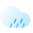
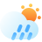

# StrasBoard

Personal dashboard for weather, transit and home metrics in Strasbourg, France.

## API Endpoints

| Endpoint                      | Method | Description                      | Response                            |
| ----------------------------- | ------ | -------------------------------- | ----------------------------------- |
| `/`                           | GET    | HTML dashboard                   | `text/html`                         |
| `/health`                     | GET    | Health check                     | `{"status":"ok","timestamp":"..."}` |
| `/api/all`                    | GET    | All data sources combined        | See AllData structure below         |
| `/api/weather`                | GET    | Weather forecast                 | Current, hourly, and daily forecast |
| `/api/transport`              | GET    | Configured stops with departures | Stop list with next departures      |
| `/api/transport/live?id={id}` | GET    | Live refresh for specific stop   | Single stop with updated departures |
| `/api/temperature`            | GET    | Indoor temperature sensor        | Temperature and humidity            |
| `/api/electricity`            | GET    | Electricity consumption history  | Daily and monthly consumption       |
| `/api/tempo`                  | GET    | EDF Tempo tariff calendar        | Today and tomorrow's color          |

**Response Structure:**

All data endpoints return:
```json
{
  "data": { /* source-specific data */ },
  "timestamp": "2026-02-05T09:30:00Z",
  "error": "optional error message"
}
```

The `/api/all` endpoint combines all sources:
```json
{
  "weather": { /* Response */ },
  "transport": { /* Response */ },
  "temperature": { /* Response */ },
  "electricity": { /* Response */ },
  "tempo": { /* Response */ },
  "timestamp": "2026-02-05T09:30:00Z"
}
```

**Caching & Degraded Mode:**
- Each source has its own TTL and refresh schedule
- Failed requests serve cached backup data with error flag (degraded mode)
- Transport supports per-stop live refresh with shorter TTL (20 seconds vs 2 minutes)

## Data Sources

### Weather
Current conditions, hourly forecast (up to 3 days), and extended daily forecast (up to 7 days) from Open-Meteo API.

```js
{
  "current": {
    "temperature": 14.5,
    "feels_like": 12.3,
    "is_day": true,
    "weather_code": 2
  },
  "hourly": [{
    "time": "2026-02-05T10:00:00Z",
    "temperature": 14.5,
    "feels_like": 12.3,
    "is_day": true,
    "weather_code": 1
  }],
  "daily": [{
    "date": "2026-02-09",
    "temp_min": 8.9,
    "temp_max": 16.7,
    "weather_code": 0
  }]
}
```

**Configuration:**
```
WEATHER_API_URL=<Open-Meteo API URL>
WEATHER_LATITUDE=48.58
WEATHER_LONGITUDE=7.75
WEATHER_TIMEZONE=Europe/Paris
```

### Transport
Live departures for configured public transport stops. Automatically resolves stop references on startup.

```js
{
  "stops": [{
    "id": 0,
    "line": "C",
    "name": "Gare Centrale",
    "color": "#F29400",
    "color_text": "#FFFFFF",
    "destinations": [{
      "name": "Neuhof Rodolphe Reuss",
      "departures": [{
        "time": "2026-02-05T10:35:00Z",
        "realtime": true
      }]
    }]
  }]
}
```

**Configuration:**
```
TRANSPORT_API_URL=<CTS API URL>
TRANSPORT_API_KEY=<CTS API key>
TRANSPORT_STOPS=<line>,<stopname>,<direction>;<line>,<stopname>,<direction>;...
```

### Temperature
Indoor temperature and humidity from a local sensor.

> [warning] Under development

```js
{
  "temperature": 21.5,
  "humidity": 45,
  "location": "Living Room"
}
```

**Configuration:** Under development

### Electricity
Daily and monthly electricity consumption with Tempo tariff breakdown (HC/HP with color prefixes: BU=blue, BC=white, R=red).

```js
{
  "days": [{
    "date": "2026-02-04",
    "BCHC": 5,
    "BCHP": 13,
    "BUHC": 1,
    // ... other tariff periods (optional)
  }],
  "months": [{
    "date": "2026-01",
    "HC": 123,
    "HP": 54,
    // ... tariff breakdown
  }]
}
```

**Configuration:**
```
ELECTRICITY_API_URL=<SER API URL>
ELECTRICITY_CLIENT_ID=<SER API client ID>
ELECTRICITY_USERNAME=<SER login username>
ELECTRICITY_PASSWORD=<SER login password>
```

### Tempo
EDF Tempo tariff color calendar for today and tomorrow (blue=low, white=medium, red=peak pricing).

```js
[
  { "date": "2026-02-05", "color": "blue" },
  { "date": "2026-02-06", "color": "white" }
]
```

**Configuration:**
```
TEMPO_API_URL=<RTE Tempo API URL>
TEMPO_AUTH_URL=<RTE OAuth API URL>
TEMPO_AUTH_TOKEN=<RTE OAuth token>
```

## Weather Icons

Thanks to *TwinkleFork* for the beautiful [**`🌈 Weather Icon Pack v1.0`**](https://www.figma.com/community/file/1469636700953030456/weather-icon-pack-v1-0-bytwinklefork) licensed under [CC BY 4.0](https://creativecommons.org/licenses/by/4.0/).

I applied minor modifications to the exported SVG files from Figma in order to fix the inner shadow effect.
The original SVG code used `feColorMatrix` filters, making the icons render rasterized in a browser.

```diff
  <feFlood flood-opacity="0" result="BackgroundImageFix"/>
  <feBlend mode="normal" in="SourceGraphic" in2="BackgroundImageFix" result="shape"/>
- <feColorMatrix in="SourceAlpha" type="matrix" values="<alpha filter matrix>" result="hardAlpha"/>
- <feOffset dx="<dx>" dy="<dy>"/>
+ <feOffset in="SourceAlpha" dx="<dx>" dy="<dy>"/>
  <feGaussianBlur stdDeviation="<deviation>"/>
- <feComposite in2="hardAlpha" operator="arithmetic" k2="-1" k3="1"/>
- <feColorMatrix type="matrix" values="<color filter matrix>"/>
+ <feComposite in="SourceAlpha" operator="out" result="innerShadowMask"/>
+ <feFlood flood-color="<color filter>"/>
+ <feComposite in2="innerShadowMask" operator="in"/>
  <feBlend mode="<mode>" in2="shape" result="<result>"/>
```

I also created 10 extra icons, fully inspired by the original pack, in order to cover all 28 weather conditions returned by Open-Meteo:

| Name                   | WMO Code |                                                                                                                          Icon(s)                                                                                                                          |
| ---------------------- | :------: | :-------------------------------------------------------------------------------------------------------------------------------------------------------------------------------------------------------------------------------------------------------: |
| Rime fog               |    48    |                                                                                      [](server/static/icon/rime_fog.svg)                                                                                      |
| Light drizzle light    |    51    |                                                                           [](server/static/icon/drizzle_light.svg)                                                                            |
| Heavy drizzle          |    53    |                                                                              [](server/static/icon/drizzle_heavy.svg)                                                                               |
| Light freezing drizzle |    56    |                                                                 [](server/static/icon/freezing_drizzle_light.svg)                                                                 |
| Freezing drizzle       |    57    |                                                                          [](server/static/icon/freezing_drizzle.svg)                                                                          |
| Light freezing rain    |    66    |                                                                     [](server/static/icon/freezing_rain_light.svg)                                                                      |
| Heavy rain showers     |    82    | [](server/static/icon/rain_showers_heavy_day.svg) [](server/static/icon/rain_showers_heavy_night.svg) |
| Light snow showers     |    85    | [](server/static/icon/snow_showers_light_day.svg) [](server/static/icon/snow_showers_light_night.svg) |

These additional icons are also licensed under [CC BY 4.0](https://creativecommons.org/licenses/by/4.0/).
